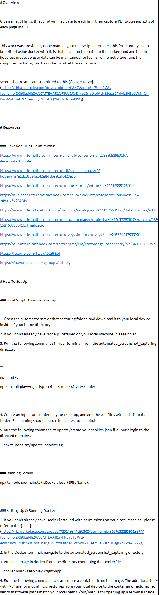

----------INSTRUCTIONS----------

--DOWNLOAD TO LOCAL--
Download automated_screenshot_capturing folder and open it;

--INSTALL PACKAGES--
npm init -y;
npm install playwright typescript ts-node @types/node;

--TO RUN--
create a input_urls folder on your Desktop
add the txt files into thar folder with the correct naming
npx ts-node src/update_cookies.ts; (login then close tab when done)
npx ts-node src/main.ts {isDocker: bool} {FileName} {indexesToRun?: number[]};

Example:
npx ts-node src/main.ts false active.txt 659 660 661 805